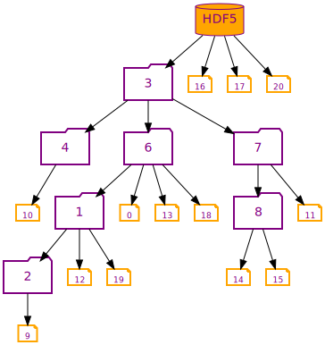

# **h5rnd**
**A random HDF5 container generator based on Prüfer sequence.** In development often the need arises for a complex HDF5 dataset with atributes and certain properties to test, measure some charaterestics of a software package. A real life dataset may be restritive in licensing or size, possibly diverting focus from the main work -- **h5rnd** fills in this gap by providing scalable random datasets, with predictive characteristics for serial and parallel HDF5.

# usage:
```
Usage: h5rnd [options] 

Optional arguments:
-h --help       shows help message and exits
-v --version    prints version information and exits
-o --output     the new hdf5 will be created/or opened rw [required]
-d --data-sets  number of datasets [default: 100]
-g --groups     number of groups [default: 10]
--hdf5          flag for HDF5 output [default: false]
--graphviz      flag for graphviz output [default: false]
```



HDF5 container `h5ls -r tree.h5`
```
/                        Group
/AkWTsmZmlndfbRhKWywY    Dataset {1000}
/luSQtFEs                Group
/luSQtFEs/EcdhmBaFpNoplYIqUGHuVZj Group
/luSQtFEs/EcdhmBaFpNoplYIqUGHuVZj/ORmqQLNnWtDSQhfexAyrczVolGPY Dataset {1000}
/luSQtFEs/pOnCmrTKREyihDZBHmDyJDpiLv Group
/luSQtFEs/pOnCmrTKREyihDZBHmDyJDpiLv/BtuejM Dataset {1000}
/luSQtFEs/pOnCmrTKREyihDZBHmDyJDpiLv/YSdbCOyP Group
/luSQtFEs/pOnCmrTKREyihDZBHmDyJDpiLv/YSdbCOyP/DNrnKgcxo Group
/luSQtFEs/pOnCmrTKREyihDZBHmDyJDpiLv/YSdbCOyP/DNrnKgcxo/CudEjqyaFtBGqcrFenMUhA Dataset {1000}
/luSQtFEs/pOnCmrTKREyihDZBHmDyJDpiLv/YSdbCOyP/VDorTtsiEIwtZ Dataset {1000}
/luSQtFEs/pOnCmrTKREyihDZBHmDyJDpiLv/YSdbCOyP/fuLsrYEurcvdOXWickWKFXLyMGY Dataset {1000}
/luSQtFEs/pOnCmrTKREyihDZBHmDyJDpiLv/qyHzilzoCyZlTaMcqZQ Dataset {1000}
/luSQtFEs/pOnCmrTKREyihDZBHmDyJDpiLv/wfXkhrapzAB Dataset {1000}
/luSQtFEs/yGnBRCmSxyrPv  Group
/luSQtFEs/yGnBRCmSxyrPv/bZPYDqZmhSXwunlyCwGMLu Group
/luSQtFEs/yGnBRCmSxyrPv/bZPYDqZmhSXwunlyCwGMLu/PnHPAPgjWqfkhBHeR Dataset {1000}
/luSQtFEs/yGnBRCmSxyrPv/bZPYDqZmhSXwunlyCwGMLu/QmNJYWKrrEXsqVxDAqkFQRPVHwaD Dataset {1000}
/luSQtFEs/yGnBRCmSxyrPv/rtaEOCMRrqKzAcRBEHQjFQ Dataset {1000}
/snWTGjtKQva             Dataset {1000}
/zzxgLfDdtDtViDnSLtrEzVpYKVZzr Dataset {1000}
```

graphviz: `cat tree.gv` sets defaults for *dataset*s, then lists the *folder*s, use `dot` directed graph for rendering, **see:** `Makefile` for details
```
digraph prufer {
	node [shape=note color=orange fontcolor=purple fontname="times bold" fillcolor=violet width=0.01 height=0.1 fontsize=9.0 labelloc=b style=bold];
	1 [shape=folder color=purple weight=2.0 width=0.75 height=0.5 fontsize=14.0 labelloc=c]
	2 [shape=folder color=purple weight=2.0 width=0.75 height=0.5 fontsize=14.0 labelloc=c]
	3 [shape=folder color=purple weight=2.0 width=0.75 height=0.5 fontsize=14.0 labelloc=c]
	4 [shape=folder color=purple weight=2.0 width=0.75 height=0.5 fontsize=14.0 labelloc=c]
	5 [shape=cylinder color=purple fillcolor=orange style=filled label=HDF5 weight=2.0 width=0.75 height=0.5 fontsize=14.0 labelloc=c]
	6 [shape=folder color=purple weight=2.0 width=0.75 height=0.5 fontsize=14.0 labelloc=c]
	7 [shape=folder color=purple weight=2.0 width=0.75 height=0.5 fontsize=14.0 labelloc=c]
	8 [shape=folder color=purple weight=2.0 width=0.75 height=0.5 fontsize=14.0 labelloc=c]

6 -> 0;
2 -> 9;
1 -> 2;
4 -> 10;
3 -> 4;
7 -> 11;
1 -> 12;
6 -> 13;
8 -> 14;
8 -> 15;
7 -> 8;
3 -> 7;
5 -> 16;
5 -> 17;
6 -> 18;
1 -> 19;
6 -> 1;
3 -> 6;
5 -> 3;
5 -> 20;
}
```


# requirements:

- [h5cpp v1.10.6-2](http://h5cpp.org) included with this project
- [argparse](https://github.com/p-ranav/argparse)  included with this project
- HDF5 C base library, no high level API or built in C++ API is needed works with:  `serial|parallel`
- c++17 or higher compiler

**visualization:**

- graphviz
- xviewer

```
h5rnd --graphviz -o tree.gv -d 30 -g 11  # create a graphviz output
dot -Tsvg tree.gv -o tree.svg            # convert `dot` file to `svg`
xviewer -wf  tree.svg                    # view it on screen
```

# known bugs:
- data size should allow a range for random values
- in addition to random strings, should pick values from dictionary: `/usr/share/dict/words`
- use the included/shipped **h5cpp** header files until I update the original **h5cpp** distribution with `h5::gr_t` support for `read|write|create` operators.